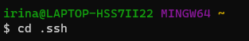
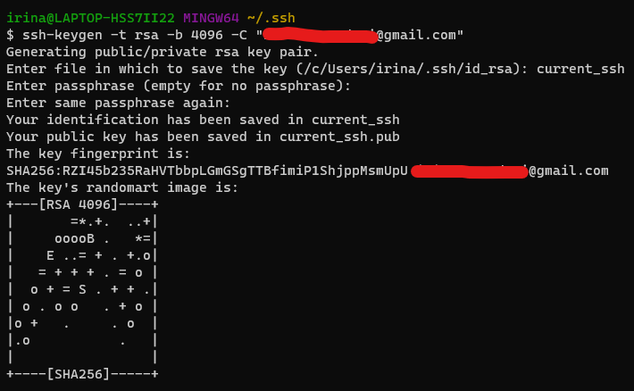
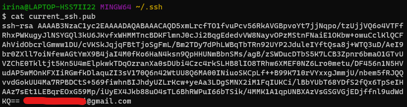
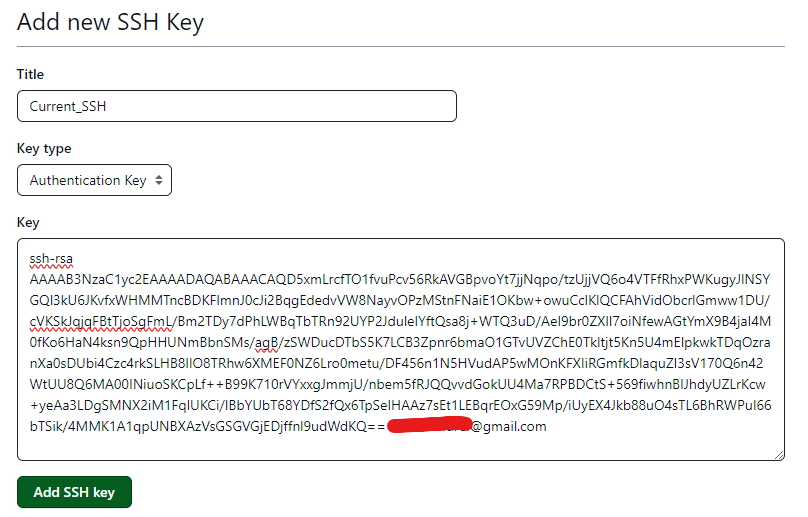
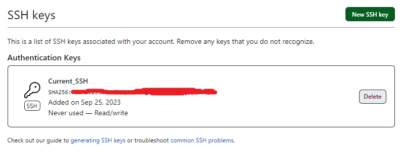
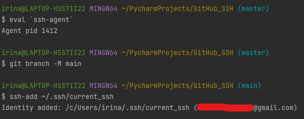
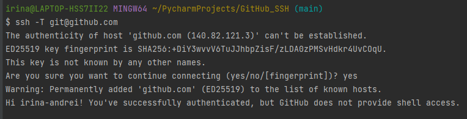
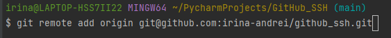
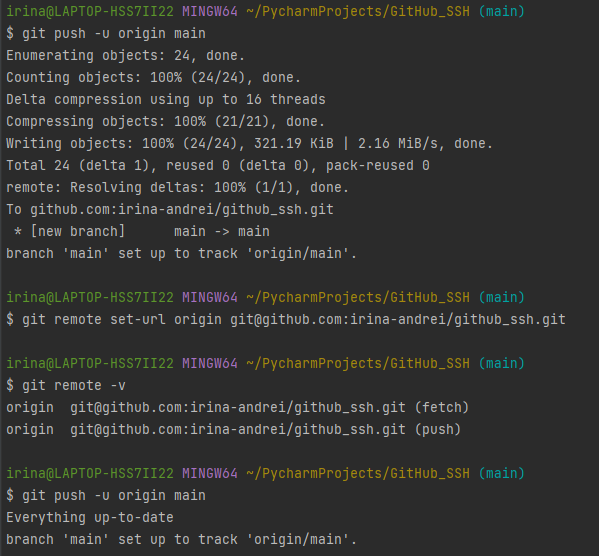

## Steps for establishing a secure SSH repository

### 1. Creating Local Repository
Into the GitBash terminal in Pycharm, enter the following commands:
```
git init
git add .
git status
git commit -m "your comment"
```


This will initialise the local repository and will you will have created your First Commit.

<br>

### 2. Creating GitHub Repository


This will create the Repository on GitHub. 

<br>

### 3. Creating .ssh Folder
In the GitBash terminal on your PC, make sure you're in your main folder (enter `cd` if in doubt). If you see `~` at the end of the first line, you're in the right place.


`mkdir .ssh` will create the hidden folder .ssh which will store your Private and Public Keys.

<br>

### 4. Opening .ssh Folder


This will open the `.ssh` folder.

<br>

### 5. Generating public/private key pair
Next we will generate the Public/Private Key Pair. Enter the following command:
```
ssh-keygen -t rsa -b 4096 -C "your email"
```


- `-t rsa` => encryption (other option: *dsa*)
- `-b 4096` => bit length
- `-C` => comment at the end of the key

<br>

### 6. Get the public key
Next we need to copy the Public Key in order to enter it on GitHub.



`cat current_ssh.pub` will display your key, which you can copy from the terminal.

Alternatively, you can also enter `~/.ssh/current_ssh.pub | clip` which will *copy your Public Key to the clipboard*.

<br>

### 7. Adding SSH to GitHub Repository
Next, simply copy your Public Key into this section of your GitHub account:


Once added successfully, you'll be able to see it on your account.


<br>

### 8. Giving the key to the agent
Next, go back to the Pycharm GitBash terminal. You'll want to give your Private Key to the agent.

```
eval `ssh-agent`
ssh-add ~/.ssh/current_ssh
```


If you're accessing this directly through Git Bash (and not through Pycharm), instead of `eval 'ssh-agent'` you'll need to enter `eval "$(ssh-agent -s)"`

It's also a good idea to make sure you switch to `main` branch as `master` is no longer accepted on GitHub:

`git branch -M main`

<br>

### 9. Allowing SSH access to GitHub
Next, to allow access to GitHub to your SSH key, enter the following command:

```
ssh -T git@github.com
```



Once you enter `yes` you will receive the message "You've successfully authenticated, but GitHub does not provide shell access."

<br>

### 10. Final step



```
git remote set-url origin git@github.com:irina-andrei/github_ssh.git
git remote add origin git@github.com:irina-andrei/github_ssh.git
```
This will set the remote connection via SSH Key and set up your local repository as the origin link to the GitHub repository.

- `git push -u origin main` -> This will push your local repository to the GitHub repository.
- `git remote -v` -> This checks the connection type (you'll be able to see if the connection is SSH or HTTPS).
- `ssh -v -T git@github.com` -> Debugging.