## Steps for establishing a secure SSH repository

### 1. Creating Local Repository
```
git init
git add .
git status
git commit -m "your comment"
```
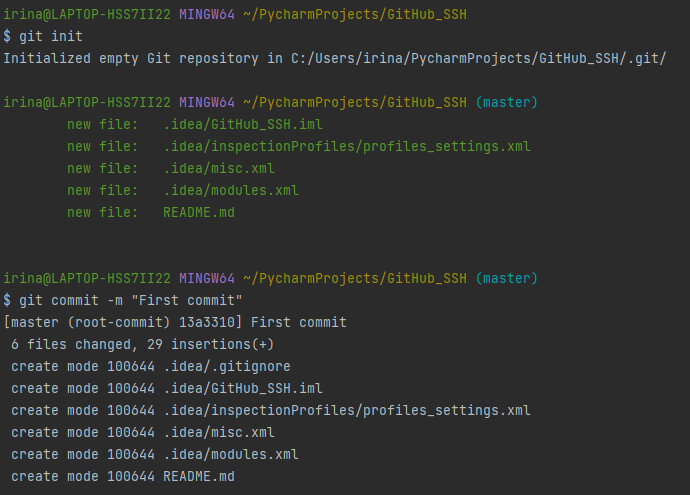

<br>

### 2. Creating GitHub Repo
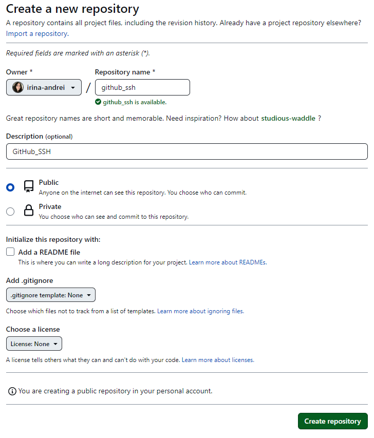

<br>

### 3. Creating .ssh Folder
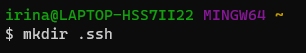

<br>

### 4. Opening .ssh Folder
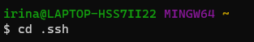

<br>

### 5. Generating public/private key pair
```
ssh-keygen -t rsa -b 4096 -C "your email"
```
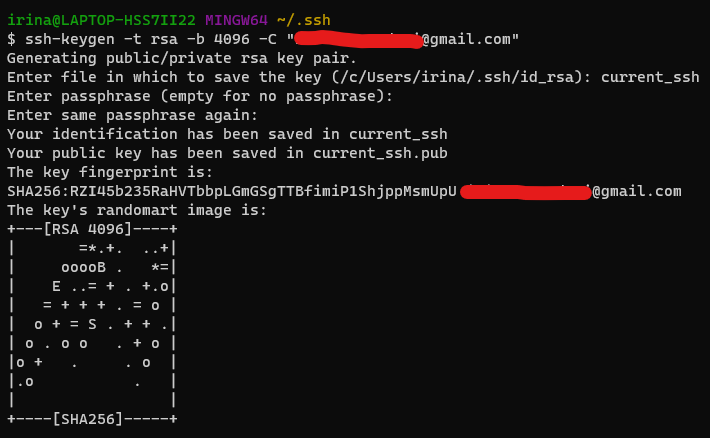

- `-t rs` => encription (other option: *dsa*)
- `-b 4096` => bit length
- `-C` => comment at the end of the key

<br>

### 6. Get the public key
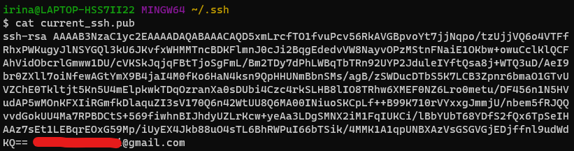

<br>

### 7. Adding SSH to GitHub Repository
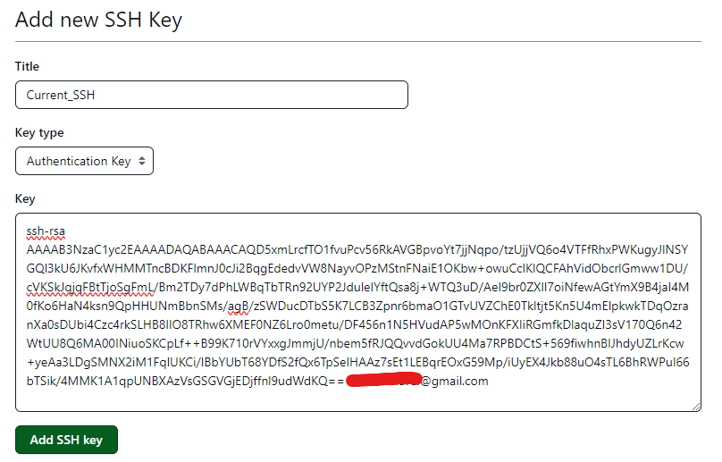
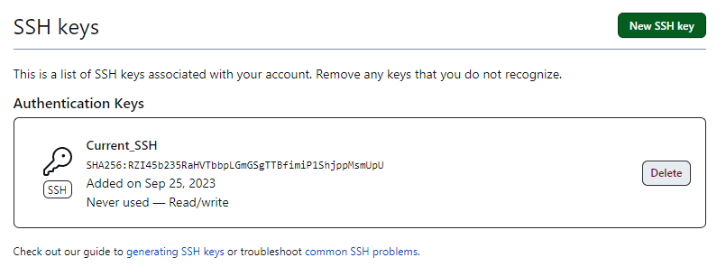

<br>

### 8. Giving the key to the agent
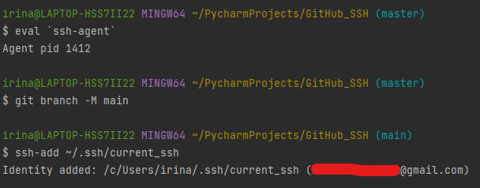

<br>

### 9. Verifying the successful creation of the SSH connection

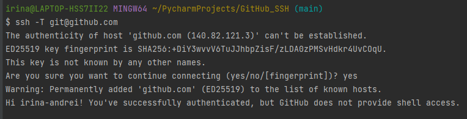

<br>

### 10. Final step
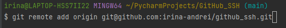
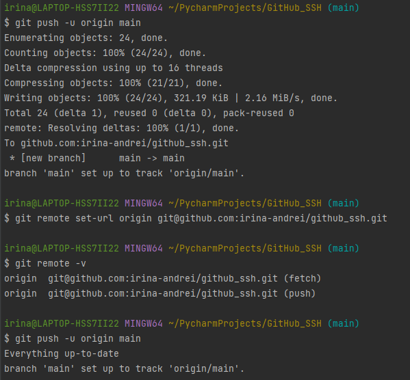
